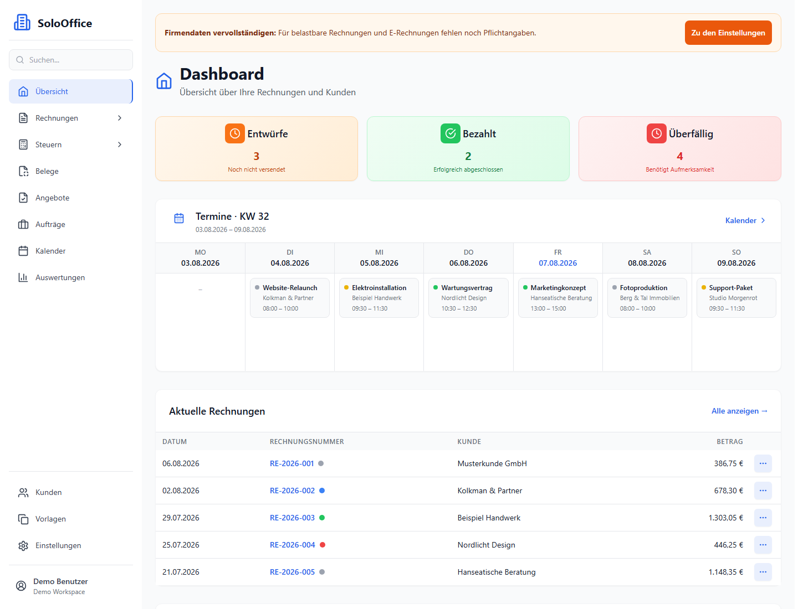
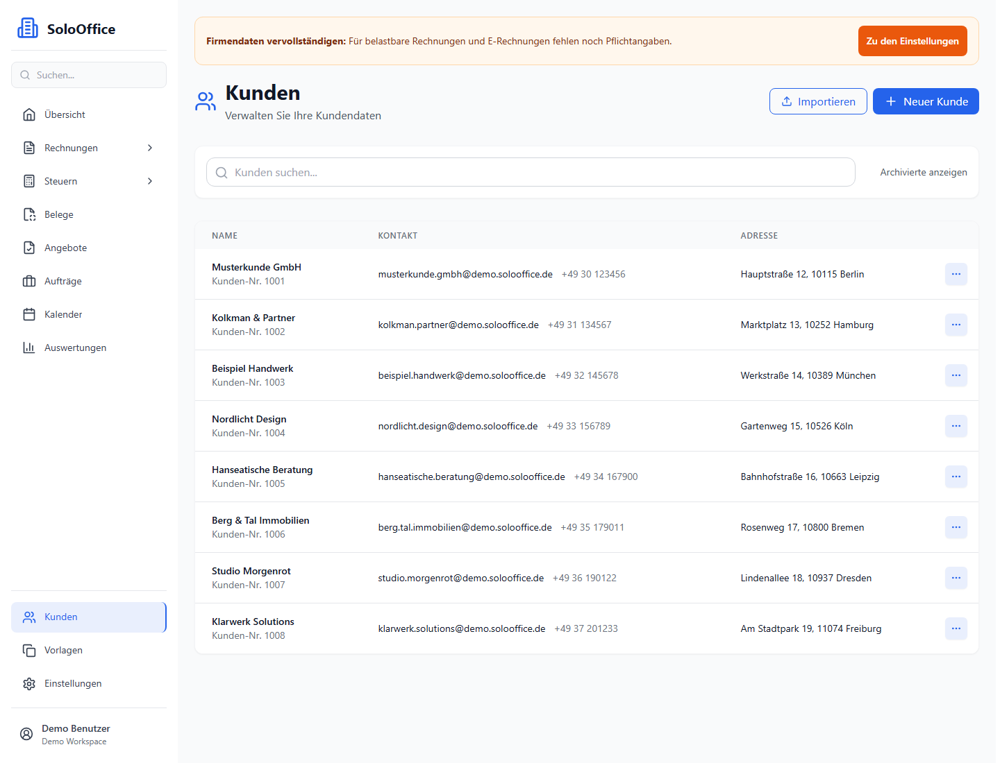
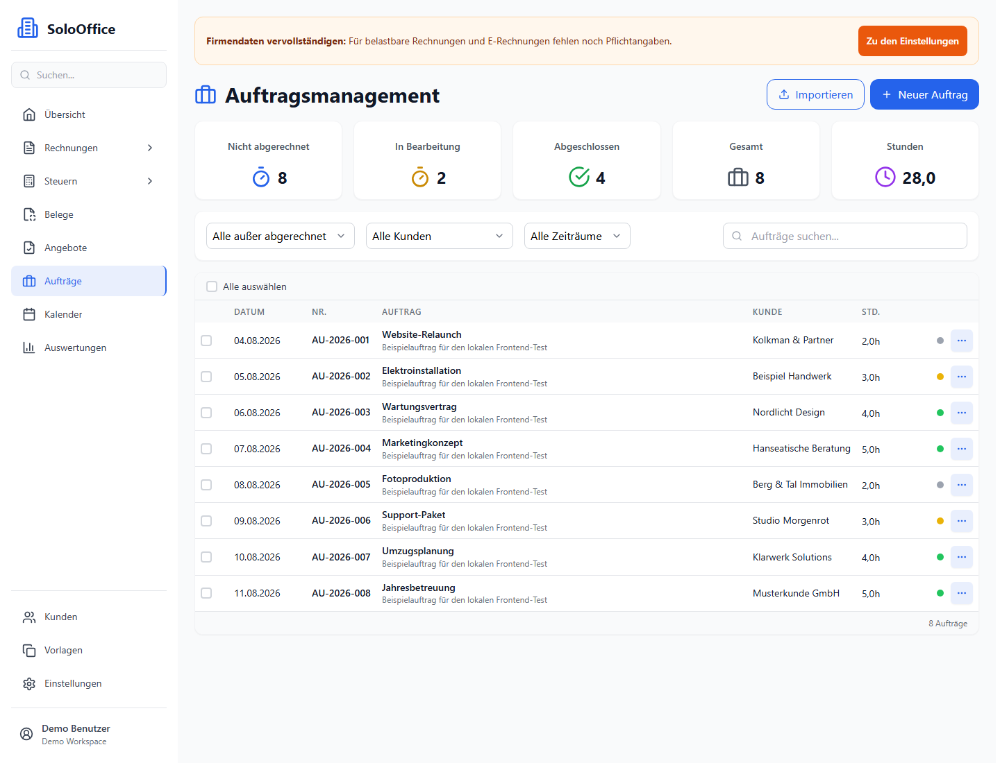
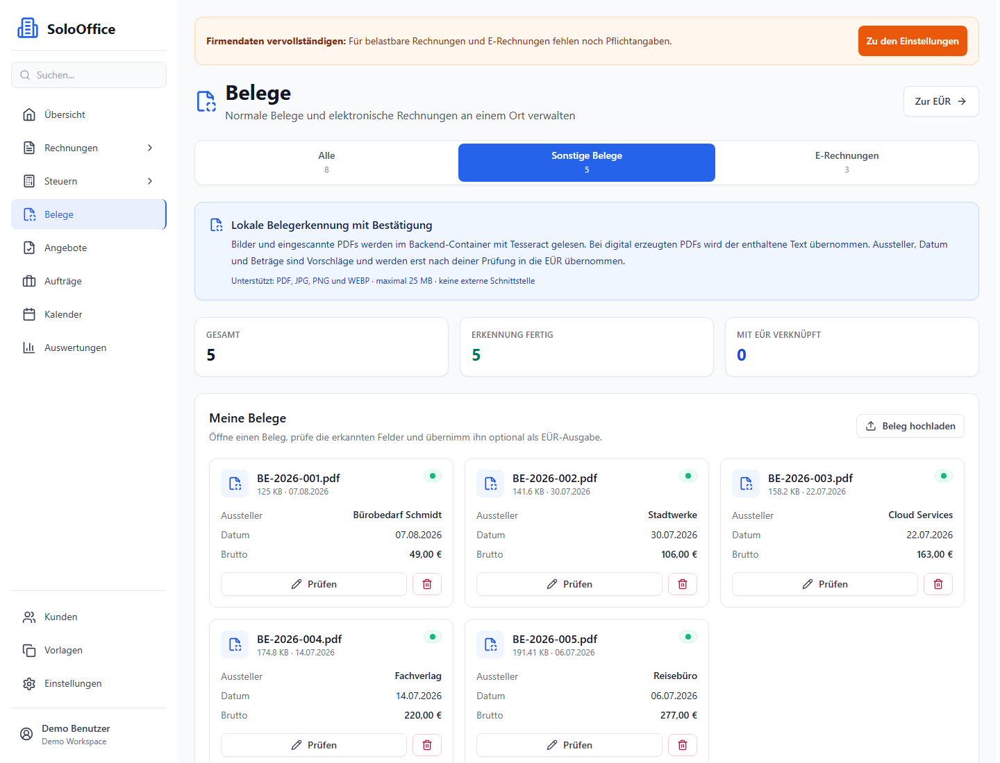
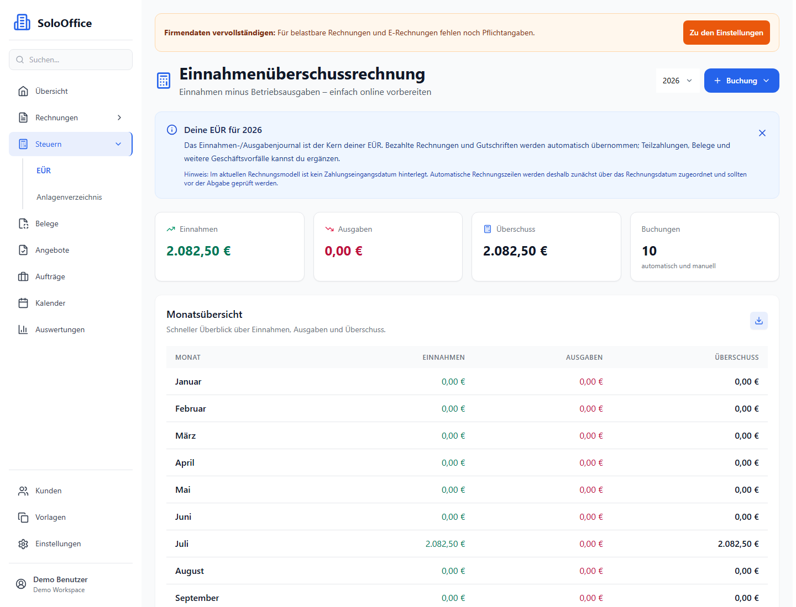
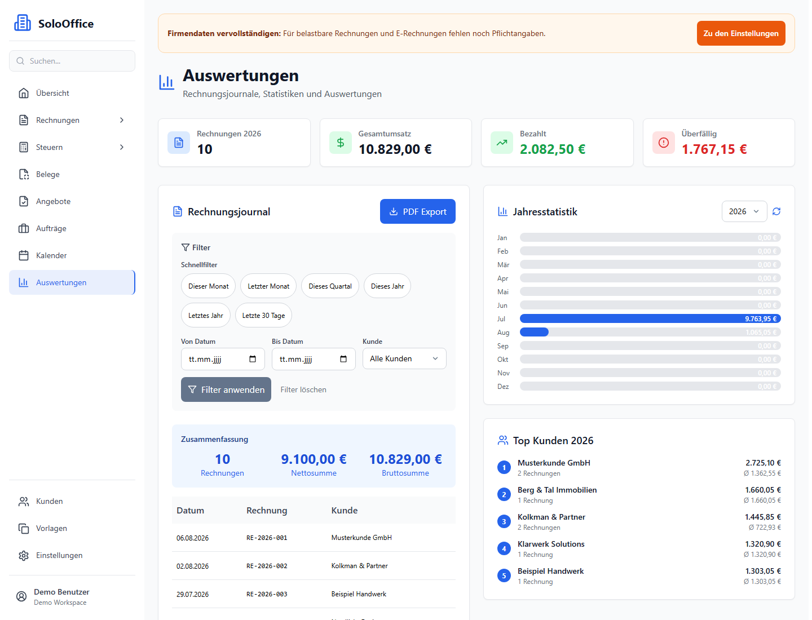
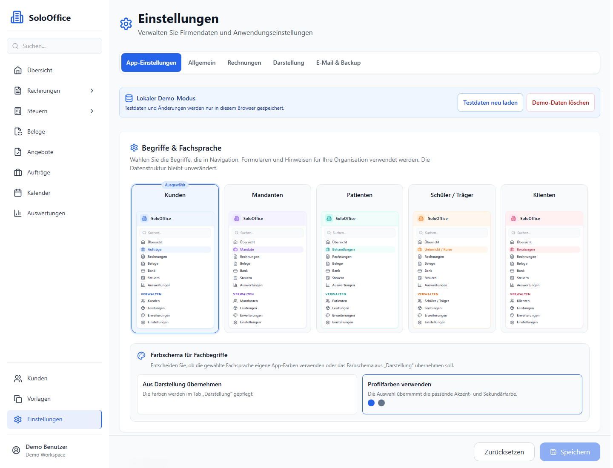

# SoloOffice

SoloOffice ist eine deutschsprachige, selbst hostbare Webanwendung für Rechnungen, Angebote, Aufträge und vorbereitende Buchhaltung. Die Anwendung verbindet Kundenverwaltung, Dokumente, E-Rechnungen, lokale Belegerkennung, EÜR, Auswertungen und Workspace-Verwaltung in einer Oberfläche.

Der aktuelle Stand ist ein Beta-/Testrelease (Unreleased, vorbereitet als v0.2.0-beta.1). Die Anwendung ist für Tests und Feedback gedacht und ersetzt keine Steuer-, Rechts- oder Datenschutzberatung.

> Die Screenshots in dieser README wurden am 07.08.2026 im lokalen Demo-Modus unter [http://localhost:5173/](http://localhost:5173/) aufgenommen. Sie zeigen Demo-Daten und keine echten Unternehmensdaten.

## Funktionsumfang

### Geschäftsabläufe

- Kundenverwaltung mit Archivierung, mehreren Kontaktadressen, kundenspezifischen Stundensätzen und Materialvorlagen
- Import-Assistent mit Vorschau, Feldzuordnung, Validierung und Duplikatbehandlung
- Angebote mit Vorlagen, Statusverwaltung, PDF-Vorschau, E-Mail-Versand und Umwandlung in Rechnungen
- Rechnungen mit Positionen, Rabatten, Steuerprofilen, Zahlungsinformationen, PDF-Download und E-Mail-Versand
- Gutschriften mit Ursprungsrechnung und Begründung
- Wiederkehrende Rechnungen mit Ausführungen und Verlauf
- Aufträge, Zeiterfassung, wiederkehrende Aufträge, Entwürfe, Standorte und digitale Signatur
- Kalender mit Tages-, Wochen- und Monatsansicht sowie Auftragsstatus
- Mahnwesen mit Fälligkeitsermittlung, Mahnstufen, Versand und Verlauf

### E-Rechnung und Dokumente

- Erzeugung von XRechnung-XML und ZUGFeRD-XML als eingebettete factur-x.xml
- Eingang elektronischer Rechnungen mit lokaler Archivierung, struktureller Prüfung und Kundenzuordnung
- Gemeinsame Dokumentenansicht für sonstige Belege und E-Rechnungen
- Lokale OCR für PDF, JPG, PNG und WEBP mit Tesseract im Backend-Container
- Erkannte Aussteller, Datums- und Betragsfelder als prüfbare Vorschläge
- Übernahme geprüfter Belege in die EÜR und nachvollziehbare Dokumentenverknüpfungen

### Vorbereitende Buchhaltung und Auswertungen

- Einnahmenüberschussrechnung mit Einnahmen, Ausgaben, Teilzahlungen, Korrekturen, Stornierungen und Änderungshistorie
- Automatische Übernahme bezahlter Rechnungen und Gutschriften in die EÜR
- Verknüpfung von Belegen mit EÜR-Buchungen
- Anlagenverzeichnis mit vorbereitender linearer Abschreibungsübersicht
- Rechnungsjournal, Jahresstatistiken, Umsatzübersichten, Top-Kunden und PDF-Export
- Steuerprofil, Nummernkreise, Vorlagen, Farbthemen und konfigurierbare Terminologieprofile

### Konten, Workspaces und Betrieb

- Lokale Benutzerkonten, serverseitige Sessions, Registrierung, E-Mail-Verifizierung und Passwort-Reset
- Mehrere Workspaces mit Wechsel, Einladungen und Rollen für Besitzer, Administratoren, Mitarbeiter und Nur-Lesen-Nutzer
- Serverseitige Datenisolation mit PostgreSQL Row-Level Security
- Workspacebezogene JSON- und ZIP-Backups mit Download, Restore und Verwaltung
- SMTP-Konfiguration, E-Mail-Historie, Diagnose- und Testfunktionen
- Lokaler Demo-Modus für UI- und Fachablauftests ohne Backend

## Aktuelle Oberfläche

### Dashboard

Der Überblick bündelt Rechnungsstatus, Kalendertermine und aktuelle Rechnungen.

### Kunden und Aufträge

Kunden und Aufträge sind als durchsuchbare, responsive Arbeitslisten mit Import- und Folgeaktionen angelegt.

### Belege und lokale OCR

Belege werden lokal verarbeitet. OCR-Ergebnisse bleiben Vorschläge und müssen vor der Übernahme in die EÜR geprüft werden.

### EÜR und Auswertungen

Die EÜR zeigt Einnahmen, Ausgaben, Überschuss und Monatswerte; die Auswertungen ergänzen Rechnungsjournal, Jahresstatistik, Filter und PDF-Export.

### Einstellungen

Terminologieprofile, Farbthemen, Unternehmensdaten, Rechnungseinstellungen, Darstellung, E-Mail und Backups werden zentral verwaltet.

## Schnellstart mit Docker

### Voraussetzungen

- Docker Desktop oder Docker Engine mit Docker Compose v2
- Bash-Umgebung für die mitgelieferten Shell-Skripte, zum Beispiel Linux, macOS, WSL oder Git Bash
- OpenSSL für die automatische Erzeugung sicherer Instanzschlüssel

### Neue Instanz anlegen

Das interaktive Deployment prüft freie Ports, erzeugt zufällige Datenbank- und Verschlüsselungsschlüssel, legt die Instanzdateien an und startet Datenbank, Backend und Frontend.

~~~bash
git clone https://github.com/TingelTangelBob/SoloOffice.git
cd SoloOffice
chmod +x deploy-instance.sh manage-instances.sh
./deploy-instance.sh
~~~

Das Skript fragt unter anderem Instanzname, Datenbank-, Backend- und Frontend-Port ab. Danach ist die Anwendung unter dem ausgegebenen Frontend-Port erreichbar, standardmäßig zum Beispiel unter http://localhost:8080.

Die erzeugten Dateien .env.<instanz> und .env.backend.<instanz> enthalten Zugangsdaten und Schlüssel. Sie gehören nicht in ein Repository und werden durch .gitignore ausgeschlossen.

### Bestehende Instanz starten oder prüfen

~~~bash
./manage-instances.sh list
./manage-instances.sh start <instanz>
./manage-instances.sh logs <instanz> [database|backend|frontend]
./manage-instances.sh backup <instanz>
~~~

Das normale Compose-Setup veröffentlicht nur das Frontend. Für eine ausdrücklich gewünschte lokale Diagnose können Backend und PostgreSQL über den Debug-Override veröffentlicht werden:

~~~bash
docker compose --env-file .env.<instanz> -f docker-compose.yml -f docker-compose.debug.yml up --build
~~~

Das Entfernen einer Instanz löscht Datenbank-Volumes und Konfiguration. Den dafür vorgesehenen Befehl nur nach eigener Sicherung verwenden:

~~~bash
./manage-instances.sh remove <instanz>
~~~

### Lokaler Demo-Modus

Für UI- und Ablaufprüfungen kann das Frontend ohne Backend betrieben werden. In .env.local wird dafür gesetzt:

~~~dotenv
VITE_DEMO_MODE=true
~~~

Die Demo meldet den Browser automatisch als Demo-Benutzer an, stellt Beispieldaten bereit und speichert Änderungen sowie zusätzliche Workspaces in localStorage. Authentifizierung, Rollen und Workspace-Isolation sind dort nur simuliert. Für den realistischen Multiuser-Test muss VITE_DEMO_MODE=false gesetzt und die Docker-Instanz verwendet werden.

Die aktuell laufende lokale Demo ist unter [http://localhost:5173/](http://localhost:5173/) erreichbar.

## Konfiguration und Sicherheit

Wichtige Betriebsvariablen werden pro Instanz gesetzt:

| Variable | Zweck |
| --- | --- |
| POSTGRES_DB, POSTGRES_USER, POSTGRES_PASSWORD | Datenbank und Zugangsdaten |
| ENCRYPTION_KEY | Verschlüsselung sensibler Werte, insbesondere SMTP-Passwörter |
| CORS_ORIGIN | Erlaubte Frontend-Ursprünge, kommasepariert |
| COOKIE_SECURE, COOKIE_SAME_SITE | Session-Cookie-Verhalten, abhängig von HTTP/HTTPS und Proxy |
| REGISTRATION_MODE | Öffnung bzw. Begrenzung der Registrierung |
| REQUIRE_EMAIL_VERIFICATION | Optionale E-Mail-Bestätigung |
| SMTP_HOST, SMTP_PORT, SMTP_SECURE, SMTP_USER, SMTP_PASS, EMAIL_FROM | E-Mail-Versand |

Für einen produktiven Betrieb müssen insbesondere ENCRYPTION_KEY, Datenbankpasswort und Session-/Proxy-Einstellungen dauerhaft und geheim verwahrt werden. Hinter HTTPS ist COOKIE_SECURE=true zu verwenden; CORS_ORIGIN muss auf die tatsächliche Frontend-Adresse zeigen.

SoloOffice bringt mehrere Schutzschichten mit:

- HttpOnly-Session-Cookies mit zufälligem Token; in der Datenbank liegt nur dessen Hash
- Passwort-Hashes mit scrypt und individuellem Salt
- PostgreSQL Row-Level Security für die Trennung aktiver Workspaces
- Rate-Limiting, Security-Header und serverseitige Rollenprüfung
- Backend-Container als unprivilegierter Benutzer
- Lokale OCR ohne Übertragung hochgeladener Dokumente an einen externen OCR-Dienst
- Backups und Restores auf den aktiven Workspace begrenzt

Diese Mechanismen ersetzen kein individuelles Hardening des Hostings, keine Offsite-Backup-Strategie und keine fachliche Prüfung des Betriebsprozesses.

## E-Rechnung: Abgrenzung

Die lokalen Generatoren und die Eingangserfassung prüfen Wohlgeformtheit und zentrale Pflichtfelder. Vor einer produktiven Freigabe müssen erzeugte Dokumente zusätzlich mit den offiziellen KOSIT-/XRechnung- bzw. FeRD-/Factur-X-Validatoren geprüft werden. Insbesondere PDF/A-3-Vollständigkeit, ICC-OutputIntent, eingebettete Schriften und eingehende ZUGFeRD-PDFs sind nicht durch die lokale Strukturprüfung abschließend bestätigt.

Eine ELSTER-Übertragung ist aktuell nicht enthalten.

## Architektur

| Bereich | Technologie |
| --- | --- |
| Frontend | React 18, TypeScript, Vite 5, Tailwind CSS 3, Context API |
| Navigation | Hash-Routing über window.location.hash |
| Backend | Node.js 20, Express, ES Modules |
| Datenbank | PostgreSQL 15 mit sequenziellen Migrationen und Row-Level Security |
| Dokumente | jsPDF, pdf-lib, PDFKit, XML-Generatoren für XRechnung/ZUGFeRD |
| OCR | Tesseract mit deutschen und englischen Sprachdaten im Backend-Container |
| E-Mail | Nodemailer mit verschlüsselter SMTP-Konfiguration |
| Deployment | Docker Compose mit database, backend und frontend |

Wichtige Bereiche im Repository:

~~~text
src/components/       Seiten, Formulare, Dialoge und Fachmodule
src/context/          globale Frontend-Zustände
src/services/api.ts   produktiver API-Client
src/services/demoApi.ts Demo-/Local-Testing-API
src/types/             zentrale TypeScript-Typen
backend/routes/        Express-Routen und Berechtigungsgrenzen
backend/services/      OCR, E-Mail, Sessions und Workspace-Dienste
backend/migrations/    fortlaufende Datenbankmigrationen
docs/                  Fach-, Test- und Betriebsdokumentation
demo/                  aktuelle README-Screenshots
~~~

## Entwicklung und Verifikation

Entwicklungs- und Build-Schritte werden innerhalb von Docker ausgeführt. Der Frontend-Build führt automatisch ESLint, TypeScript-Prüfung und Vite-Build aus:

~~~bash
docker compose --env-file .env.<instanz> -f docker-compose.yml build frontend
docker build -f backend/Dockerfile backend
git diff --check
node scripts/verify-audit-contracts.mjs
~~~

Die CI baut Frontend- und Backend-Images. Ein automatisiertes Testframework ist derzeit nicht eingerichtet. Vor einem Release müssen technische Checks und manuelle Prüfung getrennt betrachtet werden. Zu den wichtigsten manuellen Abläufen gehören:

1. Registrierung, Login, Logout, E-Mail-Verifizierung und Passwort-Reset
2. Workspace-Wechsel, Einladung und Rollenrechte mit mindestens zwei Konten
3. Import mit Vorschau, Duplikaten, Warnungen und Teilfehlern
4. Angebot, Rechnung, E-Mail-Versand, wiederkehrende Rechnung und Mahnung
5. Beleg-Upload, OCR-Prüfung, EÜR-Verknüpfung und Stornierung
6. EÜR, Anlagenverzeichnis, Reporting und PDF-Export
7. Backup/Restore ohne Vermischung zweier Workspaces

## Bekannte Grenzen des aktuellen Betastands

- Der Release ist für Tests und Feedback vorgesehen, nicht als uneingeschränkt produktiver Steuerabschluss.
- OCR-Ergebnisse sind Vorschläge und müssen vor der Übernahme geprüft werden.
- EÜR, Steuerprofile, Reports und Abschreibungen sind vorbereitende Arbeitsunterlagen und ersetzen keine steuerliche Prüfung.
- ELSTER-Übertragung ist noch nicht enthalten.
- Der vollständige Multiuser-Ablauf mit mehreren Konten und Workspaces muss in einer Docker-Umgebung noch umfassend geprüft werden.
- Die konfigurierbare Belegbezeichnung ist im Datenmodell und in der API vorbereitet, wird im aktuellen Einstellungsformular und in der Navigation aber noch nicht vollständig wirksam.
- Die lokalen E-Rechnungsprüfungen ersetzen keine offiziellen Schema- und Schematron-Validatoren.

Weitere technische Entscheidungen und Testabläufe stehen in [CONTEXT.md](CONTEXT.md), [EXPECTATIONS.md](EXPECTATIONS.md), [docs/e-rechnung-validation.md](docs/e-rechnung-validation.md) und [docs/identity-workspace-local-testing.md](docs/identity-workspace-local-testing.md).

## Lizenz und Beiträge

SoloOffice steht unter der [GNU Affero General Public License v3](LICENSE). Copyright-Vermerke, Fork-Historie und Hinweise zur ursprünglichen Codebasis sind in [NOTICE.md](NOTICE.md) dokumentiert. Beiträge zu dieser Fork werden ebenfalls unter AGPL v3 veröffentlicht.

Copyright © 2026 SoloOffice Contributors für eigene Beiträge.
