# SoloOffice

[](https://github.com/TingelTangelBob/SoloOffice/actions/workflows/ci.yml)
[](https://github.com/TingelTangelBob/SoloOffice/actions/workflows/quality.yml)
[](LICENSE)

**Links:** [Website](https://solooffice.de) · [Demo](https://demo.solooffice.de) · [Änderungsprotokoll](CHANGELOG.md) · [Releases](https://github.com/TingelTangelBob/SoloOffice/releases) · [Selbst hosten](docs/self-hosting.md)

SoloOffice ist eine deutschsprachige Webanwendung für Rechnungen, Kunden- und Auftragsverwaltung sowie vorbereitende Buchhaltung. Sie richtet sich an Selbstständige und kleine Betriebe, die ihre Geschäftsabläufe und Belege in einem eigenen Workspace verwalten möchten. SoloOffice kann selbst gehostet werden; eine öffentliche SaaS-Freigabe ist derzeit nicht erteilt.

Der aktuelle Versionsstand ist **v0.9.5**, ein Beta-/Testrelease für Tests und Feedback. Die Anwendung ersetzt keine Steuer-, Rechts- oder Datenschutzberatung und ist nicht als uneingeschränkt produktiver Steuerabschluss freigegeben. Steuerliche Auswertungen und Abschreibungen sind vorbereitende Arbeitsunterlagen. OCR-Ergebnisse müssen vor der Übernahme geprüft werden. Eine ELSTER-Übertragung ist nicht enthalten. Die Versionsnummer folgt SemVer; v1.0.0 ist an einen praktisch nachgewiesenen Self-Hosting-Betrieb einschließlich Migrationen, Mandantentrennung und Wiederherstellung gebunden.

## Funktionen

### Rechnungen und Geschäftsabläufe

- Kundenverwaltung mit Kontaktangaben, kundenspezifischen Stundensätzen und Vorlagen für Leistungen und Material
- Angebote mit Status und Umwandlung in Rechnungen
- Rechnungen mit Positionen, Rabatten, Steuerprofilen, Zahlungsinformationen, PDF-Ausgabe und E-Mail-Versand
- Gutschriften mit Bezug zur Ursprungsrechnung
- Wiederkehrende Rechnungen und Mahnungen
- Aufträge und Termine mit Zeiterfassung, Auftragsstatus und Kalender in Tages-, Wochen- und Monatsansicht
- Übernommene Altrechnungen behalten Nummer, Datum und Zahlungsstand. Ein Neudruck im aktuellen Layout wird deutlich als „Kopie / Neudruck“ markiert; das Original bleibt maßgeblich.

### E-Rechnungen und Belege

- XRechnung als strukturierte XML-Datei und ZUGFeRD als PDF mit eingebettetem `factur-x.xml`
- Erfassung eingehender E-Rechnungen mit lokaler Ablage, struktureller Prüfung und Zuordnung
- Belegverwaltung mit lokaler OCR für PDF, JPG, PNG und WEBP. Die Verarbeitung läuft im Backend-Container; erkannte Werte sind Vorschläge und werden erst nach Prüfung übernommen.
- Verknüpfung geprüfter Belege mit EÜR-Buchungen

Die lokale Prüfung von E-Rechnungen ersetzt keine Validierung mit den offiziellen KOSIT- bzw. FeRD-/Factur-X-Werkzeugen. Einzelheiten und Prüffälle stehen in [E-Rechnungsvalidierung](docs/e-rechnung-validation.md).

### EÜR, Steuern und Auswertungen

- Einnahmenüberschussrechnung mit Einnahmen, Ausgaben, Teilzahlungen, Korrekturen, Stornierungen und Änderungshistorie
- Anlagenverzeichnis mit vorbereitender linearer Abschreibungsübersicht
- Steuerprofil und Rechnungsjournal sowie Umsatz-, Jahres- und Kundenübersichten mit Exportmöglichkeiten
- Keine ELSTER-Übertragung

Diese Bereiche erstellen Arbeitsunterlagen. Die steuerliche Einordnung und Prüfung bleibt den Nutzern und ihren fachlichen Beratern vorbehalten.

### Einrichtung, Datenübernahme und Workspace-Verwaltung

- Geführte Ersteinrichtung für Firmendaten, Rechnungseinstellungen und Module
- Datenübernahme aus Excel, CSV, TSV, Text- und JSON-Dateien: Datei-Upload, Vorlagen und Komplettvorlage, automatische Spaltenzuordnung, Vorschau, Zeilenhinweise und Summenkontrolle
- Geführte Importkategorien und Schritte für Kunden, Leistungen und Preise, Rechnungen, Zahlungseingänge, Einnahmen und Ausgaben, Aufträge und Angebote
- Importläufe lassen sich bis zum Abschluss des Umzugs rückgängig machen. Die Komplettvorlage für Kunden und Rechnungen wird in getrennten Schritten verarbeitet.
- Workspace-Reset mit wählbaren Optionen für Firmendaten/Einstellungen und Umzugsstatus/Stichtag; Team und Workspace-Identität bleiben bestehen
- Mehrere Workspaces mit Einladungen und Rollen für Besitzer, Administratoren, Mitarbeiter und Nutzer mit Leserechten
- Serverseitige Workspace-Trennung durch PostgreSQL Row-Level Security
- Workspacebezogene JSON- und ZIP-Backups sowie Wiederherstellung

Der fachliche Import-Smoke-Test mit echten Importdateien und PostgreSQL ist noch offen. Die [Datenübernahme-Dokumentation](docs/datenuebernahme.md) erläutert Ablauf, Voraussetzungen und Grenzen.

### Oberfläche

- Demo-Modus mit Beispieldaten für UI- und Ablaufprüfungen. Er speichert Änderungen im Browser; Authentifizierung, Rollen und Workspace-Isolation sind dort simuliert und kein Ersatz für den Backend-Betrieb.
- Helles und dunkles Farbschema
- Responsive Oberfläche für Desktop und Mobilgeräte

## Einblicke

Die folgenden Aufnahmen zeigen den Demo-Modus mit Beispieldaten.

| Übersicht | Übersicht im Dunkelmodus |
| --- | --- |
| 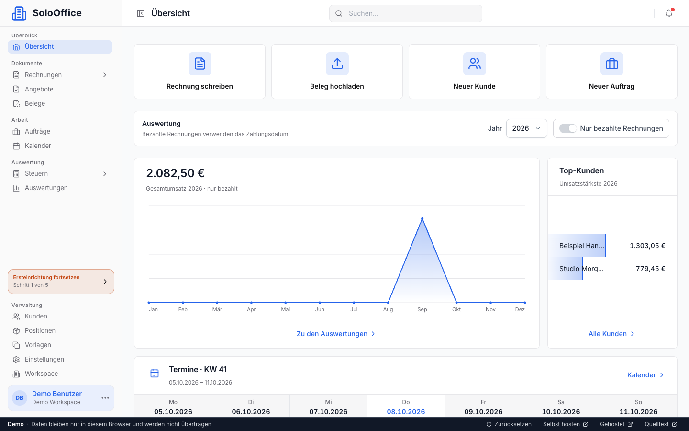 | 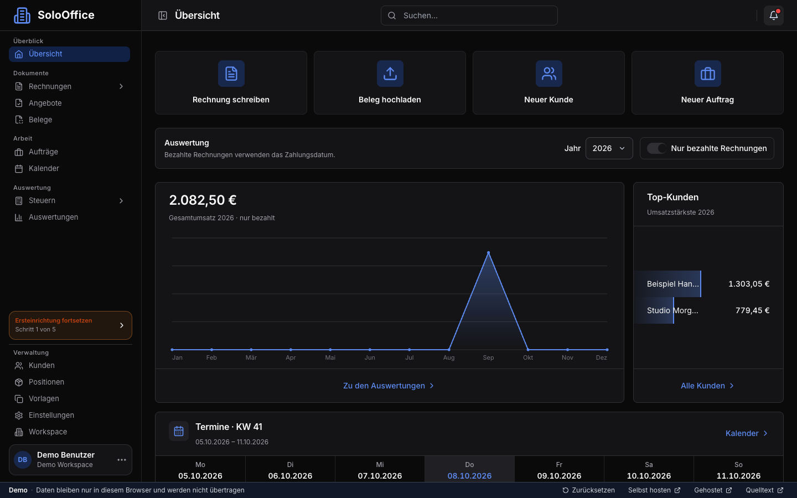 |

| Rechnungen | Neue Rechnung |
| --- | --- |
| 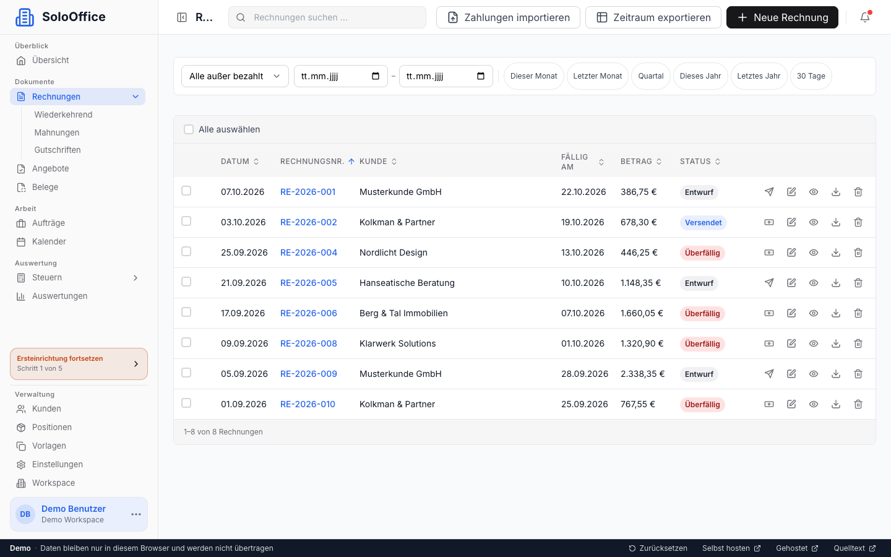 | 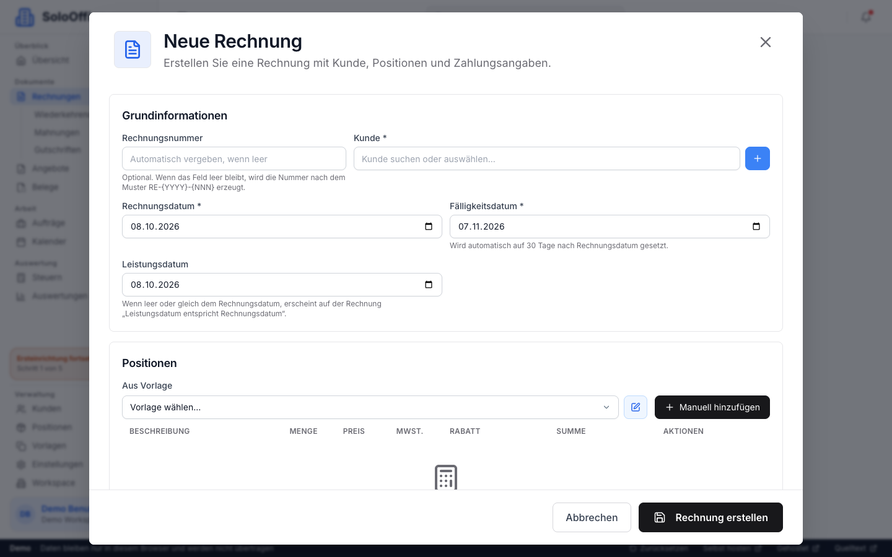 |

| Aufträge | Kalender |
| --- | --- |
| 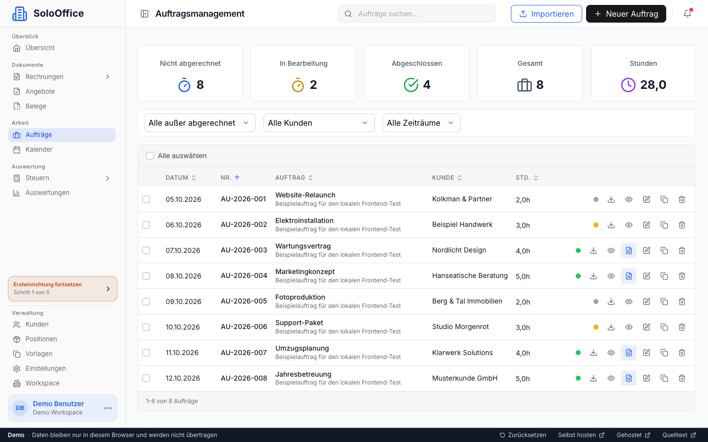 | 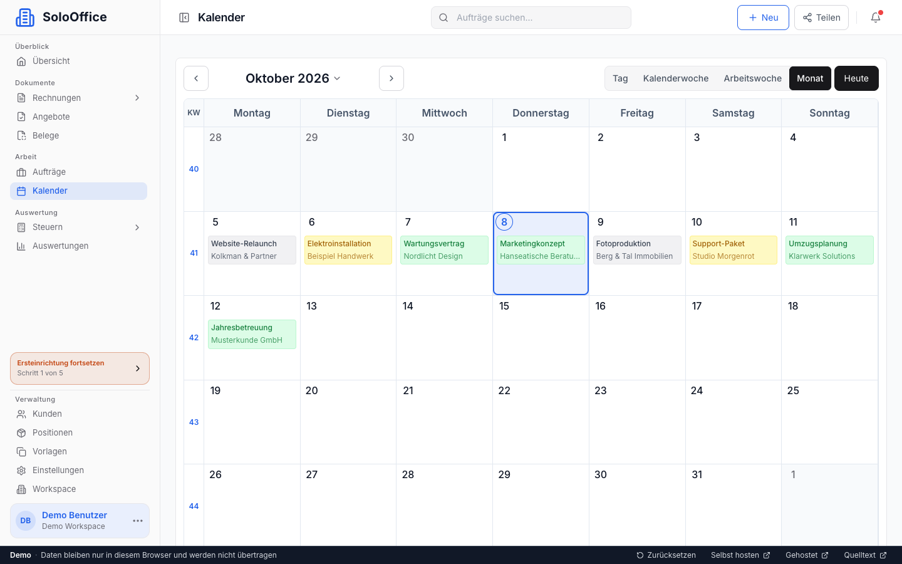 |

| Belege | EÜR |
| --- | --- |
| 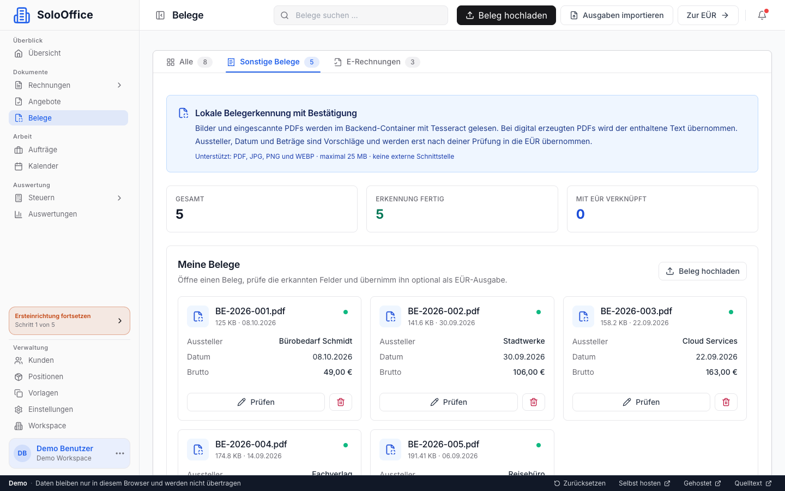 | 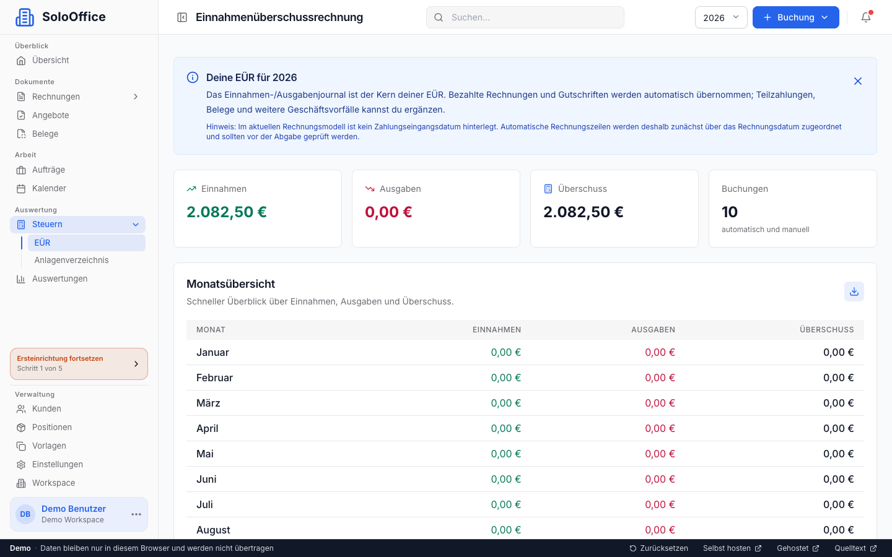 |

| Datenübernahme | Workspace zurücksetzen |
| --- | --- |
| 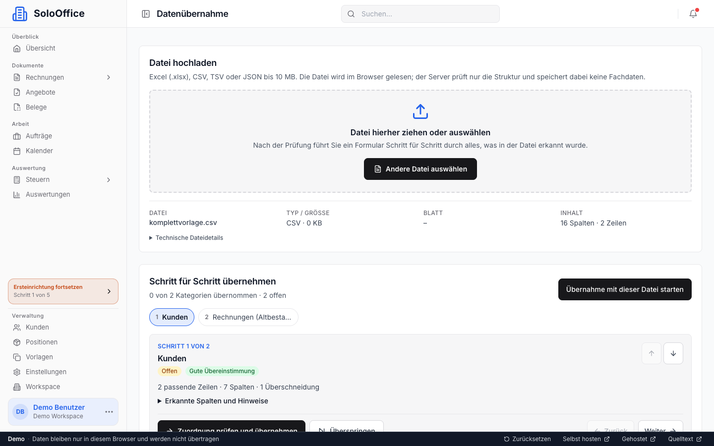 | 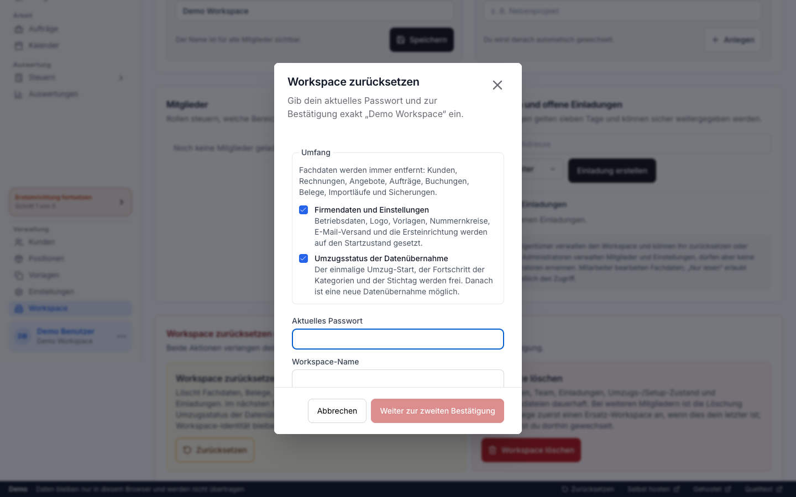 |

| Ersteinrichtung |
| --- |
| 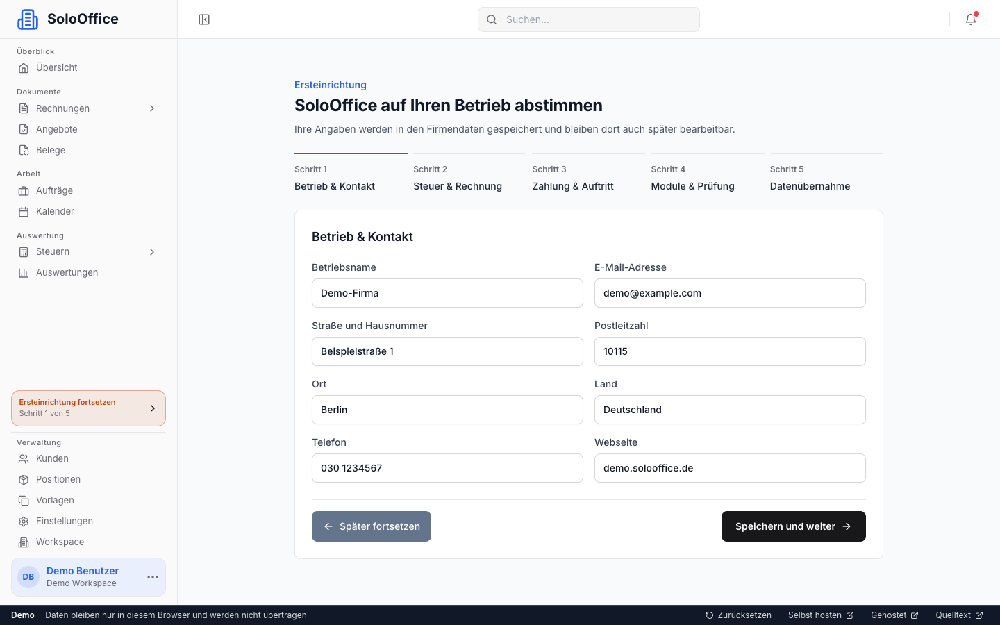 |

**Mobilansicht**

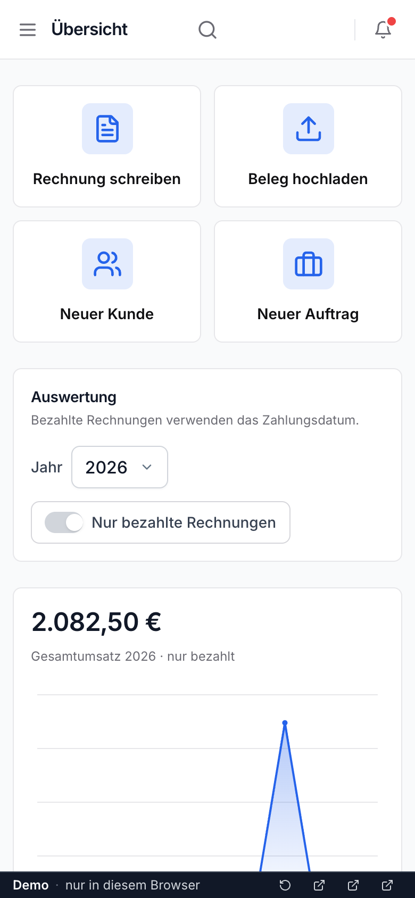 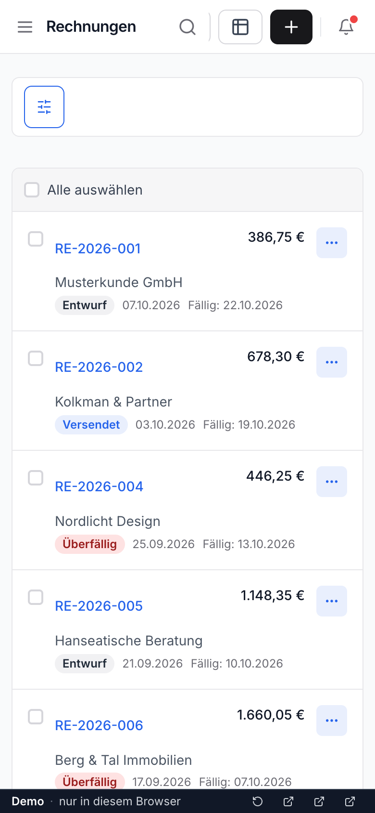

## Architektur

| Bereich | Technologie |
| --- | --- |
| Frontend | React 18, TypeScript, Vite 8, Tailwind CSS 3 |
| Backend | Node.js 22, Express, ES-Module |
| Datenbank | PostgreSQL 15 mit Migrationen und Row-Level Security |
| Dokumente | jsPDF, pdf-lib, PDFKit sowie Generatoren für XRechnung und ZUGFeRD |
| Belegerkennung | Tesseract im Backend-Container, ohne externen OCR-Dienst |
| Betrieb | Docker Compose mit Datenbank, Backend und Frontend |

Die genaue Abgrenzung der optionalen SaaS-Control-Plane-Integration und der noch offenen Hosted-Betriebsabläufe beschreibt [SaaS-Control-Plane](docs/saas-control-plane.md). Diese technischen Grundlagen bedeuten keine Freigabe eines öffentlichen SaaS-Angebots.

## Lokale Entwicklung und Demo

Entwicklungs- und Build-Schritte laufen in Docker; `npm` wird nicht direkt auf dem Host ausgeführt. Voraussetzungen, Instanzkonfiguration, Ports und Betrieb sind in [Selbst hosten](docs/self-hosting.md) beschrieben.

```bash
git clone https://github.com/TingelTangelBob/SoloOffice.git
cd SoloOffice
chmod +x deploy-instance.sh manage-instances.sh
./deploy-instance.sh
```

Das Deployment richtet eine Docker-Compose-Instanz ein. Für bestehende Instanzen stehen unter anderem diese Befehle bereit:

```bash
./manage-instances.sh list
./manage-instances.sh start <name>
./manage-instances.sh verify <name>
./manage-instances.sh update <name>
```

`update` führt den dokumentierten Sicherungs-, Build-, Aktualisierungs- und Laufzeitprüfungsablauf aus. Für eine öffentlich erreichbare Instanz sind zusätzlich TLS-Reverse-Proxy, sichere Geheimnisverwaltung, externe Backups, Wiederherstellung und die Betreiberpflichten aus der [Self-Hosting-Anleitung](docs/self-hosting.md) erforderlich. Keine Zugangsdaten oder Schlüssel in Git einchecken.

Die öffentliche [Demo](https://demo.solooffice.de) und der lokal aktivierbare Demo-Modus eignen sich zum Ausprobieren der Oberfläche. Der Demo-Modus speichert seine Beispieldaten lokal im Browser und simuliert Sicherheits- und Mehrbenutzerfunktionen.

## Tests und Qualität

Der Frontend- und Backend-Image-Build führt die jeweiligen Regressionsprüfungen aus. Der Qualitätsworkflow in GitHub Actions ergänzt statische Sicherheits- und Betriebsprüfungen, Abhängigkeitsprüfungen, Compose-Laufzeitprüfung sowie Migrationen und Workspace-RLS gegen PostgreSQL 15. Die Details und Grenzen stehen in [Automatisierte Tests](docs/automated-tests.md). Automatisierte Prüfungen ersetzen keine manuelle Browser- und Fachabnahme, SMTP-Zustellung, OCR-Qualitätsprüfung oder Validierung mit offiziellen E-Rechnungswerkzeugen.

## Lizenz, Mitwirken und Support

SoloOffice steht unter der [GNU Affero General Public License v3.0](LICENSE). Hinweise zur Herkunft und zu den Copyright-Vermerken stehen in [NOTICE.md](NOTICE.md). Eigene Beiträge zu dieser Weiterentwicklung werden ebenfalls unter AGPL v3 veröffentlicht.

Fehlerberichte und technische Fragen können im [GitHub-Repository](https://github.com/TingelTangelBob/SoloOffice) eingebracht werden. Es wird keine externe Support- oder Verkaufsadresse zugesichert.
